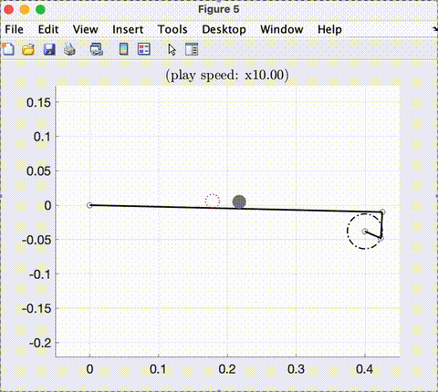
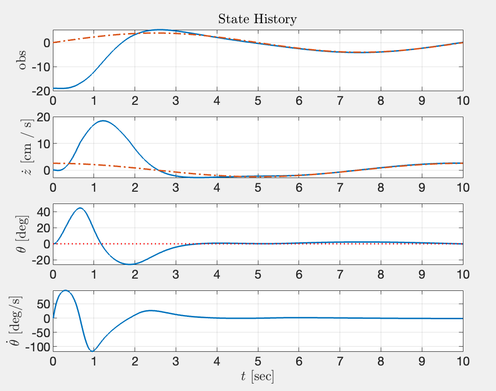
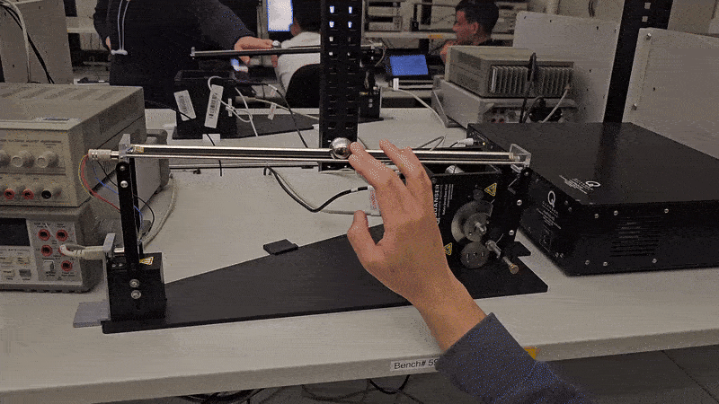

# UC Berkeley EE222/ME237 Nonlinear Systems Ball and Beam Project

📄 [Part 1 Project Report](EE222_project_report_part1.pdf)

EE222/ME237 Nonlinear Systems, Spring 2025 Starter code and instructions for the course project.

Final _code_ for the project are located in the branches denoted ..._simulation. 

### Feedback Linearization Simulation  

    
  
<em>Ball and beam simulation results using a Luenberger observer and feedback linearization.</em>

    
  
<em>Simulation plots showing the system state and reference trajectory. The controller effectively tracks the reference trajectory.</em>

### Leaderboard Attempt 

 

### Project Summary  

In this project, we implemented:  
- **Three observers**: Luenberger observer, Extended Kalman Filter (EKF), and a sliding window observer.  
- **Two controllers**:  
  - **Feedback linearization + LQR**  
  - **Time-varying LQR**  

Our report analyzes different combinations of these observers and controllers, evaluating their performance in tracking the reference trajectory.  

## Project Overview

This project involves designing and testing nonlinear controllers for a ball and beam system. The objective is to develop controllers that stabilize the ball at a desired position on the beam. You will first implement your controllers in MATLAB simulations and later test them on physical hardware.

## Understanding the Problem

To gain a full understanding of the problem and project expectations, please refer to the following documents in this repository:

[`EE_222_Course_Project.pdf`](EE_222_Course_Project.pdf) – Overview of the project and system model. (Disregard the due dates and GitHub link in this older document)

[`EE222 Lab Feedback and FAQ.pdf`](EE222_Lab_Feedback_and_FAQ.pdf) – Common issues and recommendations.

[`EE222_Lab_Part_1_Simulation.pdf`](EE222_Lab_Part_1_Simulation.pdf) – Instructions for running simulation.

[`EE222_Lab_Part_2_Hardware_Testing.pdf`](EE222_Lab_Part_2_Hardware_Testing.pdf) – Instructions for hardware testing. (To be updated)

## Code Instructions

### Prerequisites

Install MATLAB and Simulink using the Berkeley academic license.

### Getting Started

Clone or fork this repository.

Run `setup.m` or manually add the repository and its subfolders to the MATLAB path.

Modify only studentControllerInterface.m to implement your controller.

To test your controller:

Run `run_matlab_ball_and_beam.m` for a MATLAB-based simulation.

Run `run_simulink_ball_and_beam.m` for a Simulink-based simulation.
